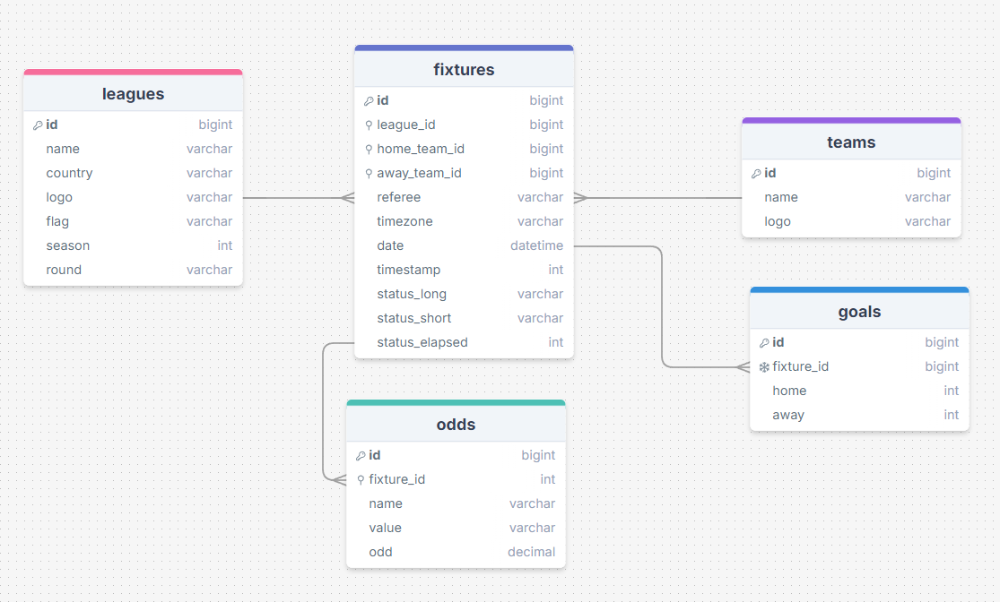

# Entrega 0 🐐⚽📊💸
## Consideraciones Generales
En las queries relacionadas al RF4 no se entregarán los partidos que tengan fecha anterior a la actual se considera pasado. Además, tal como se exige únicamente se entregarán los partidos con el status NS.

Para verificar que la renovación del certificado del ssl se debe conectar a la instancia, correr el comando 

`sudo crontab -e`

y verá escrito 

``0 0,12 * * * /usr/bin/certbot renew --quiet``

## Nombre del Dominio 📝
[thegoatdomain.me](https://thegoatdomain.me/)

## Diagrama de la Base de Datos

## Rutas 🧵
* GET: [https://thegoatdomain.me/fixtures/data](https://thegoatdomain.me/fixtures/data)

Entrega todos los datos de los distintos partidos que están almacenados en la base de datos

* GET: [https://thegoatdomain.me/fixtures/data/id](https://thegoatdomain.me/fixtures/data/id)

Entrega la información de un fixture en particular

Además, el endpoint 

* [https://thegoatdomain.me/fixtures/data](https://thegoatdomain.me/fixtures/data)

puede recibir parámetros de la forma:

 * GET: `thegoatdomain.me/fixtures/data?page=number_of_page&count=number_of_fixtures&home=local_team_name&visit=away_team_name&date=YYYY-MM-DD`

* POST: [https://thegoatdomain.me/fixtures/update](https://thegoatdomain.me/fixtures/data)

El listener envía la información del broker a este endpoint para que la API gestione la información, se realiza una actualización de los datos presentes en la base de datos y se le agregan los nuevos

## Cómo acceder a la instancia 🤓
ssh -i "thegoatKEYS.pem" ubuntu@ec2-18-223-38-194.us-east-2.compute.amazonaws.com

## Queries de Ejemplo
### Comportamiento por defecto:

* Ejemplo: GET https://thegoatdomain.me/fixtures/data

Retorna todos los partidos almacenados en la base de datos, sin filtrar por estado ni fecha.

### Filtrado por equipo de casa (home):

* Ejemplo: GET https://thegoatdomain.me/fixtures/data?home=Argentina

Retorna todos los partidos donde el equipo de casa es "Argentina" y que aún no se han jugado.

### Filtrado por equipo visitante (visit):

* Ejemplo: GET https://thegoatdomain.me/fixtures/data?visit=Chile

Retorna todos los partidos donde el equipo visitante es "Chile" y que aún no se han jugado.

### Filtrado por fecha (date):

* Ejemplo: GET https://thegoatdomain.me/fixtures/data?date=2024-09-06

Retorna todos los partidos programados para el 6 de septiembre de 2024 y que aún no se han jugado.

### Filtrado combinado por equipo de casa y equipo visitante:

* Ejemplo: GET https://thegoatdomain.me/fixtures/data?home=Argentina&visit=Chile

Retorna todos los partidos donde el equipo de casa es "Argentina" y el equipo visitante es "Chile" y que aún no se han jugado.

### Filtrado combinado por equipo de casa, equipo visitante y fecha:

* Ejemplo: GET https://thegoatdomain.me/fixtures/data?home=Argentina&visit=Chile&date=2024-09-06

Retorna el partido donde el equipo de casa es "Argentina", el equipo visitante es "Chile", y la fecha es el 6 de septiembre de 2024, que aún no se ha jugado.

## Logrado ✅ y por lograr 🟠

### Requisitos Funcionales

* RF1 ✅
* RF2 ✅
* RF3 ✅
* RF4 ✅

### Requisitos No Funcionales

* RNF1 ✅
* RNF2 ✅
* RNF3 ✅
* RNF4 ✅
* RNF5 ✅
* RNF6 ✅

### Docker Compose

* RNF1 ✅
* RNF2 ✅
* RNF3 ✅

### Variable: HTTPS

* RNF1 ✅
* RNF2 ✅
* RNF3 ✅
