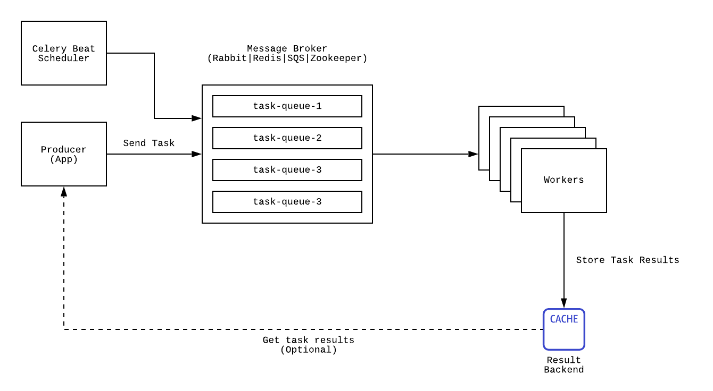

# Implementation of workers using Celery and FastAPI

## How to use this project

### Setup

First configure `.env.example` in the root folder as `.env`

Then build and start the project.
```
docker-compose build
```

```
docker-compose up
```

or

```
docker compose up --build
```

### Deployed endpoints

Then the project exposes multiple endpoints, all of them available in port 80 (HTTP) through NGINX.

**Producer or job master endpoints**:
- `/producer/api/wait_and_return`: Queues a job in the broker for the method 'wait_and_return' defined in '/project/celery_config/tasks.py'.
- `/producer/api/wait_and_return/{job_id}`: Queries the celery backend (Redis DB) for the results of the job with id 'job_id' for the method 'wait_and_return'.
- `/producer/api/sum`: A producer or job master route which queues a job in the broker for the method 'sum_to_n_job' defined in "/project/celery_config/tasks.py"
- `/producer/api/sum/{job_id}`: Queries the celery backend (Redis DB) for the results of the job with id 'job_id' for the method 'sum_to_n_job'.

**Dashboard endpoint**
- `/dashboard`: Using 'flower' a dashboard is deployed to visualize the consumers or workers and the broker.

**Load test**
- `/load-test`: Using locust a framework to start and monitor load tests is deployed. This is not inteded to be used in the project, only for the assistantship class or for curosity. It can also be used in production environments to understand our service's limits and behaviour by swarming its endpoints.

## Celery

### General overview

Celery is a useful tool in python for implementing cronjobs with workers. You can specify it's broker in requirements.txt. The usual flow is shown in the image:



You can check all the configurations in the folder `./app/celery-config`.

### Understanding Celery

First of all, it is important to understand that Celery hides a lot of the functionality that enables the master-broker-worker pipeline.

Basically, when using celery we first define a "producer" or "job master" which is in charge of receiving requests from clients and then sending said requests to the broker as "jobs". In this project the producer is a FastAPI server defined in `/project/producer.py` which uses celery to implement the previously mentioned functionality.

The broker, a redis queue in this specific project, receives said "jobs" and saves them in a queue. This queue is only responsible of receiving jobs, queing them for as long as necessary and delivering these jobs to any "consumer" or "worker" that requests a job. Once a job is delivered to a consumer, it is deleted from the queue.

The consumer is responsible of polling the broker whenever it is available, and when a job is received, it is responsible of processing it and saving its result in a "backend" (a redis database in this example). All this logic is also hidden by Celery.

The general idea is that, using the broker as an intermediary, we can scale the consumers or workers as much as needed to be able to satisfy a greater traffic, or to process anything that needs to be asynchronous.

### Project structure

#### Celery Tasks

For every celery project, we first need to defined the tasks that our workers will process.

In `/project/celery_config/config.py` there is a configuration file that has many attributes (can be explored in Celery Documentation) where the most important attribute to understand is `imports`, which defines where the tasks are defined. Then both the producer (job master) and consumer (worker) will import this config file, which Celery will use to import the defined tasks.

In `/project/celery_config/tasks.py` we define the tasks, this route is referenced in the previously mentioned `imports` configuration.

Each tasks consist of a function, and the function can be defined as any Python function, but THE MOST IMPORTANT detail to understand is that each function has the decorator `@shared_task` imported from Celery.

The `@shared_task` decorator implements (and hides):
- Everything necessary for the producer to push jobs to the queue
- The logic which the consumer uses to understand the jobs coming from the broker
- Everything necessary for the consumer to execute the task and then save the result in a "backend".

#### Producer or Job Master

The producer or Job Master is a service that provides a way to publish jobs into the broker. For this project we will provide a Web API that will enable clients to publish said jobs into the redis queue (broker).

In `/project/producer.py` we first create a Web Server using FastAPI (we can use any other web service, Celery itself does not depend on FastAPI), then we define endpoints as in any FastAPI project, and the endpoints defined will execute the tasks previously defined.

Here what is important to understand is that we do not directly execute the defined functions, for example the functions `wait_and_return` COULD be executed using `wait_and_return()` and this would run the function as a normal Python function, instead of this, we execute `wait_and_return.delay()` where `delay()` is a method inserted by the `@shared_task` decorator.

The `delay()` method will package the requests as a "job" (serialized as a JSON message because of the configuration in `/celery_config/config.py`) and will publish it to the broker.

There also are endpoints to query results using a `job id`, these endpoints also use the previously defined tasks, for example `wait_and_return`, but another method injected by the decorator is executed, `AsyncResult(job_id)`, which hides all the logic for Celery to query the "backend" or database for an specific job id and return the status of the job, with its result included if the job is finished.

#### Consumer or Worker

The Consumer or Worker is another service that can be deployed as a single instance or as a cluster of instances which will be polling the broker for jobs and running said jobs.

In `/project/consumer.py` we define a Celery Server with two parameters:
- `broker`: It is the broker URI, in this example it is a redis queue. The general format for this URI is `protocol://USER:PASSWORD@IP:PORT/instance`. 
- `backend`: It is the database URI that Celery will use to save and query results. If a backend is not defined, then the results will not be saved by Celery. The supported brokers and backends are described in [celery's documentation](https://docs.celeryq.dev/en/stable/getting-started/backends-and-brokers/index.html).

Then we inject the configuration in `/celery_config/config.py`, which has the reference to our defined tasks (and more)

And these few lines of code hide all the logic necessary for each worker to poll the broker for jobs, understand the jobs, execute them and save its results in the "backend" so it can be later accessed.

### Links of interest
  - [Simple Celery App](https://docs.celeryq.dev/en/stable/getting-started/first-steps-with-celery.html)
  - [Celery brokers](https://docs.celeryq.dev/en/stable/getting-started/backends-and-brokers/index.html)
  - [User Guide](https://docs.celeryq.dev/en/stable/userguide/index.html)
  